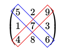

# Unidade 2: Introdução às Matrizes

## Objetivos

- Definir matrizes e suas características; 
- Apresentar a relevância das matrizes para o aprendizado de máquina; 
- Apresentar diversos tipos de matrizes; 
- Demonstrar como calcular a norma de Frobenius de uma matriz; 
- Explicar as operações de adição e subtração de matrizes, de multiplicação de matrizes e de multiplicação de uma matriz por um escalar.

## Introdução

As matrizes são a base da álgebra linear e são fundamentais para o aprendizado de máquina. Elas permitem estruturar conjuntos de dados, em que linhas representam observações e colunas representam características. Neste capítulo, você será apresentado às matrizes e suas propriedades, irá explorar diversos tipos de matrizes e também aprenderá como calcular a norma de Frobenius. Além disso, você compreenderá a multiplicação de uma matriz por um escalar, bem como as operações de adição, subtração e multiplicação matriciais, as quais são utilizadas intensivamente por diversos algoritmos de aprendizado de máquina.

## Definição e Representação de Matrizes

No contexto da álgebra linear, uma **matriz** é compreendida como um arranjo retangular de valores escalares organizados em linhas e colunas. Essa estrutura bidimensional constitui um dos pilares fundamentais não apenas da matemática, mas também de áreas aplicadas como o aprendizado de máquina, onde matrizes são utilizadas para representar conjuntos de dados, transformações lineares e parâmetros de modelos.

Formalmente, uma matriz $A$ de ordem $m \times n$ é denotada por $A = [a_{ij}]$, onde $a_{ij}$ representa o elemento localizado na $i$-ésima linha e $j$-ésima coluna. A notação completa pode ser expressa como:

$$
A = \begin{pmatrix}
a_{1,1} & a_{1,2} & \cdots & a_{1,n} \\
a_{2,1} & a_{2,2} & \cdots & a_{2,n} \\
\vdots & \vdots & \ddots & \vdots \\
a_{m,1} & a_{m,2} & \cdots & a_{m,n}
\end{pmatrix}
$$

Para ilustrar, considere dois exemplos numéricos distintos. O primeiro exemplo apresenta uma matriz $2 \times 3$:

$$
A = \begin{pmatrix}
2 & 1 & 3 \\
5 & 4 & 6
\end{pmatrix}
$$

Neste caso, o elemento $a_{2,1} = 4$, enquanto $a_{1,3} = 3$. O segundo exemplo mostra uma matriz $3 \times 2$:

$$
B = \begin{pmatrix}
-1 & 0 \\
2 & 5 \\
7 & -3
\end{pmatrix}
$$

Aqui, $b_{3,2} = -3$ e $b_{1,1} = -1$. 

Em aprendizado de máquina, matrizes como essas são frequentemente utilizadas para representar conjuntos de dados, onde cada linha corresponde a uma observação e cada coluna a uma característica (*feature*). Tomemos como exemplo a tabela a seguir que apresenta um histórico parcial de alguns produtos agrícolas no Rio Grande do Norte.

| Ano  | Cebola (T) | Mandioca (T) | Melão (T) | Tomate (T) |
|:---: |:----: |:----:   |:----:   |:----:|
| 2025 | 7.173 | 492.395 | 362.678 | 5.688 |
| 2024 | 6.980 | 276.245 | 505.212 | 6.399 |
| 2023 | 5.399 | 297.506 | 604.566 | 6.082 |
| 2022 | 2.898 | 220.083 | 442.107 | 6.090 |

Essa mesma tabela poderia ser representada pela matriz $P$:

$$
P = \begin{pmatrix}
2025 & 7.173 & 492.395 & 362.678 & 5.688 \\
2024 & 6.980 & 276.245 & 505.212 & 6.399 \\
2023 & 5.399 & 297.506 & 604.566 & 6.082 \\
2022 & 2.898 & 220.083 & 442.107 & 6.090 \\
\end{pmatrix}
$$

## Ordem de uma Matriz

A **ordem de uma matriz** refere-se ao par ordenado que especifica o número de linhas ($m$) e o número de colunas ($n$), denotado por $m \times n$. Quando $m = n$, a matriz é classificada como **quadrada**; caso contrário, é denominada **retangular**.

Como primeiro exemplo, considere a matriz quadrada de ordem $3 \times 3$:

$$
C = \begin{pmatrix}
2 & 1 & 0 \\
-1 & 4 & 3 \\
5 & 2 & -2
\end{pmatrix}
$$

Nesta matriz, o número de linhas é igual ao número de colunas, ambas iguais a 3, caracterizando uma matriz quadrada de ordem 3.

Como segundo exemplo, temos uma matriz retangular de ordem $4 \times 2$:

$$
D = \begin{pmatrix}
1 & 0 \\
0 & 1 \\
2 & 3 \\
-1 & 4
\end{pmatrix}
$$

Aqui, $m = 4$ e $n = 2$, com $m \neq n$, configurando uma matriz retangular. 

Em aprendizado de máquina, matrizes retangulares são comuns em conjuntos de dados, onde o número de observações (linhas) geralmente difere do número de características (colunas). Por exemplo, em um conjunto de dados com 1000 amostras e 20 atributos, teríamos uma matriz de ordem $1000 \times 20$.

Uma **matriz coluna** é aquela que possui apenas uma coluna, ou seja, ordem $m \times 1$. Exemplo:

$$
\mathbf{x} = \begin{pmatrix}
2 \\
-1 \\
5
\end{pmatrix}
$$

Uma **matriz linha** possui apenas uma linha, ou seja, ordem $1 \times n$. Exemplo:

$$
\mathbf{y} = \begin{pmatrix}
3 & 0 & -2 & 1
\end{pmatrix}
$$

EXERCÍCIO DE FIXAÇÃO

**Questão 1**: Qual é a ordem da matriz $A$ apresentada abaixo?

$$
A = \begin{pmatrix}
4 & -9 & 0 & 8 \\
-1 & \frac{1}{2} & 15 & 7 \\
\end{pmatrix}
$$

- A) $2 \times 2$
- B) $1 \times 2$
- C) $2 \times 4$
- D) $4 \times 2$

**Resposta Correta:** C
> **Justificativa:** A ordem de uma matriz corresponde a, respectivamente, seu número de linhas e de colunas. Como $A$ possui duas linhas e quatro colunas, sua ordem é $2 \times 4$.

## Igualdade de Matrizes

Duas matrizes $A = [a_{ij}]$ e $B = [b_{ij}]$ são consideradas iguais se, e somente se, possuírem a mesma ordem $m \times n$ e todos os seus elementos correspondentes forem iguais, ou seja, $a_{ij} = b_{ij}$ para todo $i = 1, \ldots, m$ e $j = 1, \ldots, n$.

Para exemplificar, considere as matrizes:

$$
A = \begin{pmatrix}
1 & 2 \\
3 & 4
\end{pmatrix}, \quad
B = \begin{pmatrix}
1 & 2 \\
3 & 4
\end{pmatrix}, \quad
C = \begin{pmatrix}
1 & 2 \\
3 & 5
\end{pmatrix}
$$

As matrizes $A$ e $B$ são iguais, pois todos os elementos coincidem. Já $A$ e $C$ não são iguais, pois $a_{2,2} = 4 \neq 5 = c_{2,2}$.

## Matriz Nula

A **matriz nula**, denotada por $0$, é uma matriz em que todos os elementos são iguais a zero. Exemplo:

$$
0_{2 \times 3} = \begin{pmatrix}
0 & 0 & 0 \\
0 & 0 & 0
\end{pmatrix}
$$

DICA: A matriz nula atua como elemento neutro na adição e na subtração de matrizes.

## Norma de Frobenius

A **norma de Frobenius** de uma matriz $A_{m \times n}$ é definida como a raiz quadrada da soma dos quadrados de todos os seus elementos:

$$
\|A\|_F = \sqrt{\sum_{i=1}^{m} \sum_{j=1}^{n} (a_{ij})^2}
$$

Como exemplo, considere a matriz:

$$
A = \begin{pmatrix}
1 & -2 \\
3 & 4
\end{pmatrix}
$$

Calculamos:

$$
\|A\|_F = \sqrt{1^2 + (-2)^2 + 3^2 + 4^2} = \sqrt{1 + 4 + 9 + 16} = \sqrt{30} \approx 5{,}477
$$

Se pegarmos uma matriz $A_{m \times n}$ e "estica-la" em um único vetor gigante de comprimento $m \cdot n$, a norma de Frobenius da matriz é rigorosamente idêntica à norma Euclidiana (comprimento) desse vetor. Sob esta ótica, a norma de Frobenius mede a distância em linha reta da matriz $A$ até a matriz nula em um espaço cartesiano de $m \times n$ dimensões.

CURIOSIDADE: a norma de Frobenius é particularmente útil em aprendizado de máquina, pois fornece uma medida da magnitude global dos parâmetros de um modelo. Por exemplo, em técnicas de regularização como o *weight decay*, a norma de Frobenius é utilizada para penalizar pesos excessivamente grandes, evitando sobreajuste do modelo.

**Questão 2**: Qual é o valor da norma de Frobenius da matriz $A$ apresentada abaixo?

$$
A = \begin{pmatrix}
4 & -5 & 0 \\
-1 & 3 & 7 \\
\end{pmatrix}
$$

- A) $10$
- B) $88$
- C) $\sqrt{10}$
- D) $48$

**Resposta Correta:** A
> **Justificativa:** A norma de Frobenius é dados pelo seguinte cálculo: $\|A\|_F = \sqrt{4^2+(-5)^2+0^2+(-1)^2+3^2+7^2} = \sqrt{16+25+0+1+9+49} = \sqrt{100} = 10$.

## Matriz Transposta e Matriz Simétrica

A **transposta** de uma matriz $A_{m \times n}$, denotada por $A^T$, é a matriz de ordem $n \times m$ obtida pela troca de linhas por colunas. Formalmente, $(A^T)_{ij} = a_{ji}$.

Primeiro exemplo:

$$
A = \begin{pmatrix}
1 & 2 & 3 \\
4 & 5 & 6
\end{pmatrix}
\quad \Rightarrow \quad
A^T = \begin{pmatrix}
1 & 4 \\
2 & 5 \\
3 & 6
\end{pmatrix}
$$

Segundo exemplo:

$$
B = \begin{pmatrix}
-1 & 0 \\
2 & 7 \\
3 & -4
\end{pmatrix}
\quad \Rightarrow \quad
B^T = \begin{pmatrix}
-1 & 2 & 3 \\
0 & 7 & -4
\end{pmatrix}
$$

Uma **matriz simétrica** é uma matriz quadrada que é igual à sua própria transposta, ou seja, $A = A^T$. Isso implica que $a_{ij} = a_{ji}$ para todos $i, j$. Exemplo:

$$
S = \begin{pmatrix}
1 & 2 & 3 \\
2 & 4 & 5 \\
3 & 5 & 6
\end{pmatrix}
\quad \Rightarrow \quad
S^T = \begin{pmatrix}
1 & 2 & 3 \\
2 & 4 & 5 \\
3 & 5 & 6
\end{pmatrix}
$$

CURIOSIDADE: Matrizes simétricas são importantes em aprendizado de máquina, especialmente em *kernels* de máquinas de vetores de suporte (SVM) e em matrizes de covariância entre atributos.

## Diagonal Principal, Diagonal Secundária e Matriz Diagonal

A **diagonal principal** de uma matriz quadrada é o conjunto de elementos $a_{ij}$ onde $i = j$, ou seja, $a_{11}, a_{22}, \ldots, a_{nn}$. A **diagonal secundária** é o conjunto de elementos onde $i + j = n + 1$, percorrendo da extremidade superior direita até a inferior esquerda.

Na figura abaixo, os elementos da diagonal principal estão dentro do retângulo azul, enquanto que os elementos da diagonal principal estão dentro do retângulo vermelho.

Uma **matriz diagonal** é uma matriz quadrada em que todos os elementos fora da diagonal principal são nulos. Exemplo:

$$
D = \begin{pmatrix}
2 & 0 & 0 \\
0 & -3 & 0 \\
0 & 0 & 5
\end{pmatrix}
$$

## Matriz Triangular Superior e Inferior

Uma **matriz triangular superior** é uma matriz quadrada em que todos os elementos abaixo da diagonal principal são nulos, ou seja, $a_{ij} = 0$ para $i > j$. Exemplo:

$$
U = \begin{pmatrix}
1 & 2 & 3 \\
0 & 4 & 5 \\
0 & 0 & 6
\end{pmatrix}
$$

Uma **matriz triangular inferior** é uma matriz quadrada em que todos os elementos acima da diagonal principal são nulos, ou seja, $a_{ij} = 0$ para $i < j$. Exemplo:

$$
L = \begin{pmatrix}
1 & 0 & 0 \\
2 & 3 & 0 \\
4 & 5 & 6
\end{pmatrix}
$$

LEMBRETE: É importante ressaltar que, por definição, matrizes triangulares devem ser quadradas.

CURIOSIDADE: Matrizes triangulares surgem em decomposições matriciais como as decomposições LU e de Cholesky, as quais são utilizadas para resolver sistemas lineares e calcular matrizes inversas de forma eficiente.

## Matriz Unitária

A **matriz unitária**, também conhecida como **matriz identidade**, é uma matriz quadrada em que todos os elementos da diagonal principal são iguais a 1 e todos os demais são 0. A matriz unitária é usualmente denotada por $I_n$, onde $n$ indica a ordem da matriz. Exemplo:

$$
I_3 = \begin{pmatrix}
1 & 0 & 0 \\
0 & 1 & 0 \\
0 & 0 & 1
\end{pmatrix}
$$

A propriedade fundamental da matriz identidade é que $AI = IA = A$ para qualquer matriz $A$ de ordem compatível.

## Adição de Matrizes

A adição de matrizes é definida apenas para matrizes de mesma ordem. Se $A = [a_{ij}]$ e $B = [b_{ij}]$ são matrizes $m \times n$, então a soma $C = A + B$ é a matriz $m \times n$ cujos elementos são $c_{ij} = a_{ij} + b_{ij}$.

Exemplo:

$$
A = \begin{pmatrix}
1 & 2 \\
3 & 4
\end{pmatrix}, \quad
B = \begin{pmatrix}
5 & 6 \\
7 & 8
\end{pmatrix}
$$

$$
A + B = \begin{pmatrix}
1+5 & 2+6 \\
3+7 & 4+8
\end{pmatrix} = \begin{pmatrix}
6 & 8 \\
10 & 12
\end{pmatrix}
$$

A adição de matrizes é comutativa ($A + B = B + A$) e associativa ($A + (B + C) = (A + B) + C$).

## Subtração de Matrizes

A subtração de matrizes segue a mesma lógica da adição, sendo definida apenas para matrizes de mesma ordem. Se $A = [a_{ij}]$ e $B = [b_{ij}]$ são matrizes $m \times n$, então $C = A - B$ é a matriz $m \times n$ com $c_{ij} = a_{ij} - b_{ij}$.

Exemplo:

$$
A = \begin{pmatrix}
5 & 6 \\
7 & 8
\end{pmatrix}, \quad
B = \begin{pmatrix}
1 & 2 \\
3 & 4
\end{pmatrix}
$$

$$
A - B = \begin{pmatrix}
5-1 & 6-2 \\
7-3 & 8-4
\end{pmatrix} = \begin{pmatrix}
4 & 4 \\
4 & 4
\end{pmatrix}
$$

LEMBRETE: Lembre-se que a adição ou subtração de matrizes só pode ser realizada entre matrizes de mesma ordem.

## Multiplicação de Matriz por um Escalar

A multiplicação de uma matriz $A = [a_{ij}]$ de ordem $m \times n$ por um escalar $c$ resulta em uma matriz $B = cA$ de mesma ordem, onde cada elemento é multiplicado por $c$, ou seja, $b_{ij} = c \cdot a_{ij}$.

Exemplo numérico:

$$
A = \begin{pmatrix}
1 & 2 \\
3 & 4
\end{pmatrix}, \quad c = 3
$$

$$
cA = 3 \cdot \begin{pmatrix}
1 & 2 \\
3 & 4
\end{pmatrix} = \begin{pmatrix}
3 & 6 \\
9 & 12
\end{pmatrix}
$$

Propriedades importantes incluem $c(A + B) = cA + cB$ e $(c + d)A = cA + dA$. 

CURIOSIDADE: Em aprendizado de máquina, a multiplicação por escalar é utilizada em algoritmos de otimização, como o gradiente descendente, onde o gradiente é multiplicado pela taxa de aprendizado antes de ser subtraído dos pesos.

EXERCÍCIOS DE FIXAÇÃO

**Questão 3**: Dadas as matrizes $A$ e $B$ a seguir, qual é a matriz resultante de $A + B$?

$$
A = \begin{pmatrix}
4 & -5 & 0 \\
-1 & 3 & 7 \\
\end{pmatrix}
, \quad
B = \begin{pmatrix}
-2 & -1 & 9 \\
1 & 10 & 9 \\
\end{pmatrix}
$$

- A) $\begin{pmatrix}
2 & -4 & 9 \\
2 & 13 & 2 \\
\end{pmatrix}$
- B) $\begin{pmatrix}
6 & 6 & 9 \\
2 & 13 & 2 \\
\end{pmatrix}$
- C) $\begin{pmatrix}
2 & -6 & 9 \\
0 & 13 & 16 \\
\end{pmatrix}$
- D) Não é possível somar as matrizes pois elas possuem ordens distintas.

**Resposta Correta:** C
> **Justificativa:** A adição de matrizes é realizada somando-se os elementos que ocupam a mesma linha e matriz das matrizes envolvidas. Desta forma:  
$
A + B = 
\begin{pmatrix}
4+(-2)& (-5)+(-1) & 0+9 \\
(-1)+1 & 3+10 & 7+9 \\
\end{pmatrix}
=
\begin{pmatrix}
2 & -6 & 9 \\
0 & 13 & 16 \\
\end{pmatrix}
$

**Questão 4**: Dada a matriz $A$ apresentada a seguir, e o escalar $k=-2$, qual é a matriz resultante da operação $k \cdot A$?

$$A = \begin{pmatrix}  -3 & 4 \\  2 & 0 \\  1 & -5  \end{pmatrix}$$

- A) $\begin{pmatrix}  6 & -8 \\  -4 & 0 \\  -2 & 10  \end{pmatrix}$
- B) $\begin{pmatrix}  -5 & 2 \\  0 & -2 \\  -1 & -7  \end{pmatrix}$
- C) $\begin{pmatrix}  6 & 4 \\  -4 & 0 \\  -2 & -5  \end{pmatrix}$
- D) $\begin{pmatrix}  -6 & 8 \\  4 & 0 \\  2 & -10  \end{pmatrix}$.

**Resposta Correta:** A
> **Justificativa:** Para multiplicar uma matriz por um escalar, multiplicamos cada elemento da matriz pelo escalar. Desta forma: 
$
k \cdot A = 
\begin{pmatrix}
(-2) \cdot (-3) & (-2) \cdot 4 \\
(-2) \cdot 2 & (-2) \cdot 0 \\
(-2) \cdot 1 & (-2) \cdot (-5)
\end{pmatrix}
=
\begin{pmatrix}  6 & -8 \\  -4 & 0 \\  -2 & 10  \end{pmatrix}
$

## Conclusão

Nesta unidade, exploramos os fundamentos essenciais das matrizes e suas operações no contexto da álgebra linear e do aprendizado de máquina. Ao longo do capítulo, definimos o conceito de matriz como um arranjo bidimensional de escalares e vimos como essa estrutura é utilizada para organizar conjuntos de dados, em que linhas representam observações e colunas correspondem a atributos.

Aprofundamos nossa compreensão ao classificar as matrizes por sua ordem (quadradas ou retangulares) e ao examinar tipos especiais — como matrizes nulas, simétricas, diagonais, triangulares e unitárias —, reconhecendo a relevância de cada uma na simplificação de problemas computacionais e em decomposições matriciais. Além disso, aprendemos a calcular a norma de Frobenius, uma métrica de magnitude global amplamente empregada na regularização de modelos.

Por fim, cobrimos as operações matriciais elementares: a igualdade, a transposição, a adição, a subtração e a multiplicação por um escalar. Essas operações formam a base matemática necessária para a manipulação de dados e a atualização de parâmetros em algoritmos de otimização. O domínio desses conceitos prepara você para avançar com confiança rumo a tópicos mais complexos, como a multiplicação entre matrizes, a inversão matricial e as transformações lineares no aprendizado de máquina.

## Glossário

* **Diagonal Principal:** Conjunto de elementos $a_{ij}$ de uma matriz quadrada em que o índice da linha é igual ao índice da coluna ($i = j$).

* **Diagonal Secundária:** Conjunto de elementos $a_{ij}$ de uma matriz quadrada de ordem $n$ que satisfazem a condição $i + j = n + 1$, percorrendo da extremidade superior direita à inferior esquerda.

* **Matriz:** Arranjo retangular bidimensional de valores escalares organizados em linhas e colunas.

* **Matriz Coluna:** Matriz composta por apenas uma coluna, possuindo ordem $m \times 1$.

* **Matriz Diagonal:** Matriz quadrada em que todos os elementos fora da diagonal principal são iguais a zero.

* **Matriz Linha:** Matriz composta por apenas uma linha, possuindo ordem $1 \times n$.

* **Matriz Nula:** Matriz na qual todos os seus elementos são iguais a zero, atuando como elemento neutro na adição e subtração matricial.

* **Matriz Quadrada:** Matriz que possui o número de linhas igual ao número de colunas ($m = n$).

* **Matriz Retangular:** Matriz cujo número de linhas é diferente do número de colunas ($m \neq n$).

* **Matriz Simétrica:** Matriz quadrada que é estritamente igual à sua transposta ($A = A^T$), ou seja, $a_{ij} = a_{ji}$ para todos os índices.

* **Matriz Transposta:** Matriz $A^T$ obtida a partir da troca ordenada de linhas por colunas de uma matriz $A$, de modo que $(A^T)_{ij} = a_{ji}$.

* **Matriz Triangular Inferior:** Matriz quadrada na qual todos os elementos localizados acima da diagonal principal são nulos ($a_{ij} = 0$ para $i < j$).

* **Matriz Triangular Superior:** Matriz quadrada na qual todos os elementos localizados abaixo da diagonal principal são nulos ($a_{ij} = 0$ para $i > j$).

* **Matriz Unitária (Identidade):** Matriz quadrada $I_n$ na qual todos os elementos da diagonal principal são iguais a 1 e todos os demais elementos são iguais a 0.

* **Norma de Frobenius:** Métrica de magnitude global de uma matriz, calculada pela raiz quadrada da soma dos quadrados de todos os seus elementos ($\Vert{}A\Vert{}_F = \sqrt{\sum (a_{ij})^2}$).

* **Ordem de uma Matriz:** Par ordenado $m \times n$ que especifica, respectivamente, a quantidade de linhas ($m$) e colunas ($n$) da matriz.

## Referências

AGGARWAL, Charu C. **Linear Algebra and Optimization for Machine Learning**: A Textbook. Cham: Springer, 2020.

BROWNLEE, Jason. **Basics of Linear Algebra for Machine Learning**: Discover the Mathematical Language of Data in Python. [S. l.]: Machine Learning Mastery, 2018. E-book.

OLVER, P. J.; SHAKIBAN, C. **Applied Linear Algebra**. 2. ed. Cham: Springer International Publishing, 2018.